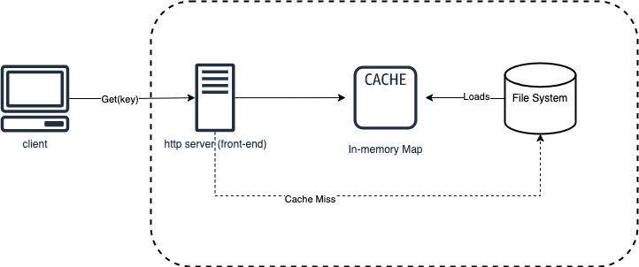

# Pavostore

Pavostore is a simple read-only key-value store backed by file I/O and in-memory caching.

## To build
```
go build
```
## To run
```
./pavostore -port 8080 -filename ./input_data/test.data
```

## High Level Design



### APIs:

Get("key") --> returns "value", where datastore["key"] = "value" 


## Data Store Design

The data store is a file I/O backed store which is fronted by a read-only cache. Clients connect to the server using http protocol, for e.g. `http://<IP>:<Port>/get?key=<key>`. Concurrent connections are handled using `net/http` libarary in Go which uses multiplexing of requests. 

In-memory caches are faster than file I/O and hence we load the file based datastore into the cache, and serve the clients using the latter. Note as per requirements we have a maximum entry of 1 million in the data store and we set the size of the cache accordingly. In case this criteria needs to to relaxed and we have more entries, then a cache miss will result in a file system read. Currently, this version does not implement a replacement strategy, but it can be added if needed.


## Back of the envelop calculations

Note by requirement the implementation should be able to handle files that contain up to a million key-value pairs.

Assumption: Key-value string is 128 characters(bytes) which is typical length of sentences. 

Hence, based on the above DataStore size = ~ (128byes x 1M entries) = ~ 128 MB, if we add additional space for redundancy we can double that to 256 MB. 

Since most MACs/PCs these days come with 16+GB memory, this will easily fit into the system memory and hence we need to load only once from file to memory and then serve the clients.

Note, that however if the requirements change to handle more than 100M+ entries the total size becomes 25GB+ at which point the system might crash and throttle. Hence we need to develop a in-memory caching strategy. The latter is described below:  least 25% 

For caching to be effective we need to serve at least 20-25% of the total entries using caching.
 
Cache size = 20% of 25GB i.e. 5GB i.e. around 40M entries, which should be good enough for this use case.

## Redundancy

In case of a system crash and accidental deletions, we want to keep a copy of our file stored in a separate dsik partition or a cloud blob storage (e.g. s3).

## Discussion questions

* How much data can your server handle? How could you improve it so it can handle even larger datasets?
    - Currently, hard limit is set for 1M entries in the data store with each line size <= 128 bytes, i.e. total size of 128 MB
    - For more data size, the store uses file I/O to get the key value 
    - A sharding mechanism could be used to include mutliple nodes with a slice of the file keys
    - Caching mechanism could be improved with better preloading and replacement algorithms. 

* How many milliseconds it takes for the client to get a response on average? How could you improve the latency?
    - Cache only latency ~10-14ms
    - File I/O latency for sample input ~15ms (not much of a difference)

* What are some failure patterns that you can anticipate?
    - File system gets corrupted, wrong/no value is returned
    - File gets deleted by mistake and backup is not up to date in cloud
    - Single point of failure frontend server crashes
